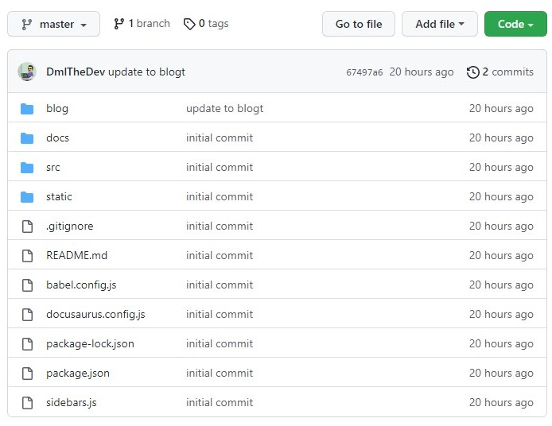

Update 2.3.4 brings a lot of new content to the table. From now on the websites code will be updated and frequently committed on the corresponding [github repo.](https://github.com/DmlTheDev/Dml-World/) 



I have also upgraded the nav bar text with icons. This was done by implementing the fontawesome `<script>` into the header. 

```js
scripts: [
      {
        src: 'https://kit.fontawesome.com/.js',
        async: true,
        crossorigin: "anonymous"
      },
    ],
```


Also I updated the footer with more links! Going to be working on more projects to add to `docs`.