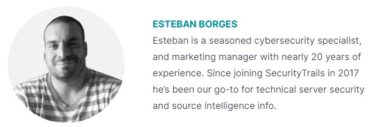

There are a lot of ways to avoid falling into the hands of a Google Dork.

These measures are suggested to prevent your sensitive information from being indexed by search engines.

- Protect private areas with a user and password authentication and also by using IP-based restrictions.
- Encrypt your sensitive information (user, passwords, credit cards, emails, addresses, IP addresses, phone numbers, etc).
- Run regular vulnerability scans against your site, these usually already use popular Google Dorks queries and can be pretty effective in detecting the most common ones.
- Run regular dork queries against your own website to see if you can find any important information before the bad guys do. You can find a great list of popular dorks at the Exploit DB Dorks database.
- If you find sensitive content exposed, request its removal by using Google Search Console.
- Block sensitive content by using a robots.txt file located in your root-level website directory.
### Using robots.txt configurations to prevent Google Dorking
One of the best ways to prevent Google dorks is by using a robots.txt file. Let’s see some practical examples.

The following configuration will deny all crawling from any directory within your website, which is pretty useful for private access websites that don’t rely on publicly-indexable Internet content.

```
User-agent: *
Disallow: /
```
You can also block specific directories to be excepted from web crawling. If you have an /admin area and you need to protect it, just place this code inside:
```
User-agent: *
Disallow: /admin/
```
This will also protect all the subdirectories inside.

Restrict access to specific files:
```
User-agent: *
Disallow: /privatearea/file.htm
```
Restrict access to dynamic URLs that contain ‘?’ symbol
```
User-agent: *
Disallow: /*?
```
To restrict access to specific file extensions you can use:
```
User-agent: *
Disallow: /*.php$/
```
In this case, all access to .php files will be denied.

## Final thoughts
Google is one of the most important search engines in the world. As we all know, it has the ability to index everything unless we explicitly deny it.

Today we learned that Google can be also used as a hacking tool, but you can stay one step ahead of the bad guys and use it regularly to find vulnerabilities in your own websites. You can even integrate this and run automated scans by using custom third-party Google SERPs APIs.

If you’re a security researcher it can be a practical tool for your cybersecurity duties when used responsibly.

While Google Dorking can be used to reveal sensitive information about your website that is located and indexable via HTTP protocol, you can also perform a full DNS audit by using the SecurityTrails toolkit.

----
 
 
