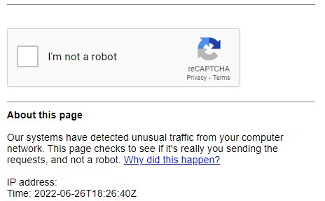

A Google Dork, also known as Google Dorking or Google hacking, is a valuable resource for security researchers. For the average person, Google is just a search engine used to find text, images, videos, and news. However, in the infosec world, Google is a useful information gathering tool.

In other words: Google “Dorking” is the practice of using Google to find vulnerable web applications and servers by using native Google search engine capabilities.

Unless you block specific resources from your website using a robots.txt file, Google indexes all the information that is present on any website. Logically, after some time any person in the world can access that information if they know what to search for.

**Important note:** while this information is publicly available on the Internet, and it is provided and encouraged to be used by Google on a legal basis, people with the wrong intentions could use this information to harm your online presence.

Be aware that Google also knows who you are when you perform this kind of query. For this reason and many others, it’s advised to use it only with good intentions, whether for your own research or while looking for ways to defend your website against this kind of vulnerability.

While some webmasters expose sensitive information on their own, this doesn’t mean it’s legal to take advantage of or exploit that information. If you do so you’ll be marked as a cybercriminal. It’s pretty easy to track your browsing IP, even if you’re using a VPN service. It’s not as anonymous as you think.

Before reading any further, be aware that Google will start blocking your connection if you connect from a single static IP. It will ask for captcha challenges to prevent automated queries.

