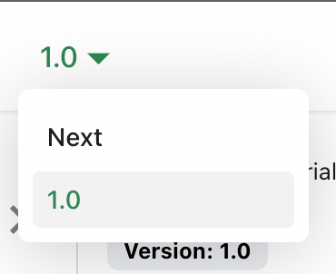

# Website Structure 
This is how the websites markdown structure operates!

---
# Create a Page

Add **Markdown or React** files to `src/pages` to create a **standalone page**:

- `src/pages/index.js` -> `localhost:3000/`
- `src/pages/foo.md` -> `localhost:3000/foo`
- `src/pages/foo/bar.js` -> `localhost:3000/foo/bar`
---
## Create your first React Page

Create a file at `src/pages/my-react-page.js`:

```jsx title="src/pages/my-react-page.js"
import React from 'react';
import Layout from '@theme/Layout';

export default function MyReactPage() {
  return (
    <Layout>
      <h1>My React page</h1>
      <p>This is a React page</p>
    </Layout>
  );
}
```

A new page is now available at `http://localhost:3000/my-react-page`.
---
## Create your first Markdown Page

Create a file at `src/pages/my-markdown-page.md`:

```mdx title="src/pages/my-markdown-page.md"
# My Markdown page

This is a Markdown page
```

A new page is now available at `http://localhost:3000/my-markdown-page`.

---
# Create a Blog Post

Docusaurus creates a **page for each blog post**, but also a **blog index page**, a **tag system**, an **RSS** feed...

## Create your first Post

Create a file at `blog/2021-02-28-greetings.md`:

```md title="blog/2021-02-28-greetings.md"
---
slug: greetings
title: Greetings!
authors:
  - name: Joel Marcey
    title: Co-creator of Docusaurus 1
    url: https://github.com/JoelMarcey
    image_url: https://github.com/JoelMarcey.png
  - name: Sébastien Lorber
    title: Docusaurus maintainer
    url: https://sebastienlorber.com
    image_url: https://github.com/slorber.png
tags: [greetings]
---

Congratulations, you have made your first post!

Feel free to play around and edit this post as much you like.
```

A new blog post is now available at `http://localhost:3000/blog/greetings`.


---

# Create a Document

Documents are **groups of pages** connected through:

- a **sidebar**
- **previous/next navigation**
- **versioning**

## Create your first Doc

Create a markdown file at `docs/hello.md`:

```md title="docs/hello.md"
# Hello

This is my **first Docusaurus document**!
```

A new document is now available at `http://localhost:3000/docs/hello`.

## Configure the Sidebar

Docusaurus automatically **creates a sidebar** from the `docs` folder.

Add metadata to customize the sidebar label and position:

```md title="docs/hello.md" {1-4}
---
sidebar_label: 'Hi!'
sidebar_position: 3
---

# Hello

This is my **first Docusaurus document**!
```

It is also possible to create your sidebar explicitly in `sidebars.js`:

```js title="sidebars.js"
module.exports = {
  tutorialSidebar: [
    {
      type: 'category',
      label: 'Tutorial',
      // highlight-next-line
      items: ['hello'],
    },
  ],
};
```
---
# Deploy your site

Docusaurus is a **static-site-generator** (also called **[Jamstack](https://jamstack.org/)**).

It builds your site as simple **static HTML, JavaScript and CSS files**.

## Build your site

Build your site **for production**:

```bash
npm run build
```

The static files are generated in the `build` folder.

## Deploy your site

Test your production build locally:

```bash
npm run serve
```

The `build` folder is now served at `http://localhost:3000/`.

You can now deploy the `build` folder **almost anywhere** easily, **for free** or very small cost (read the **[Deployment Guide](https://docusaurus.io/docs/deployment)**).

---
## What's next?

- Read the [official documentation](https://docusaurus.io/).
- Add a custom [Design and Layout](https://docusaurus.io/docs/styling-layout)
- Add a [search bar](https://docusaurus.io/docs/search)
- Find inspirations in the [Docusaurus showcase](https://docusaurus.io/showcase)
- Get involved in the [Docusaurus Community](https://docusaurus.io/community/support)

---

# Manage Docs Versions

Docusaurus can manage multiple versions of your docs.

## Create a docs version

Release a version 1.0 of your project:

```bash
npm run docusaurus docs:version 1.0
```

The `docs` folder is copied into `versioned_docs/version-1.0` and `versions.json` is created.

Your docs now have 2 versions:

- `1.0` at `http://localhost:3000/docs/` for the version 1.0 docs
- `current` at `http://localhost:3000/docs/next/` for the **upcoming, unreleased docs**

## Add a Version Dropdown

To navigate seamlessly across versions, add a version dropdown.

Modify the `docusaurus.config.js` file:

```js title="docusaurus.config.js"
module.exports = {
  themeConfig: {
    navbar: {
      items: [
        // highlight-start
        {
          type: 'docsVersionDropdown',
        },
        // highlight-end
      ],
    },
  },
};
```

The docs version dropdown appears in your navbar:



## Update an existing version

It is possible to edit versioned docs in their respective folder:

- `versioned_docs/version-1.0/hello.md` updates `http://localhost:3000/docs/hello`
- `docs/hello.md` updates `http://localhost:3000/docs/next/hello`

---

# Translate your site

Let's translate `docs/intro.md` to French.

## Configure i18n

Modify `docusaurus.config.js` to add support for the `fr` locale:

```js title="docusaurus.config.js"
module.exports = {
  i18n: {
    defaultLocale: 'en',
    locales: ['en', 'fr'],
  },
};
```

## Translate a doc

Copy the `docs/intro.md` file to the `i18n/fr` folder:

```bash
mkdir -p i18n/fr/docusaurus-plugin-content-docs/current/

cp docs/intro.md i18n/fr/docusaurus-plugin-content-docs/current/intro.md
```

Translate `i18n/fr/docusaurus-plugin-content-docs/current/intro.md` in French.

## Start your localized site

Start your site on the French locale:

```bash
npm run start -- --locale fr
```

Your localized site is accessible at `http://localhost:3000/fr/` and the `Getting Started` page is translated.

:::caution

In development, you can only use one locale at a same time.

:::

## Add a Locale Dropdown

To navigate seamlessly across languages, add a locale dropdown.

Modify the `docusaurus.config.js` file:

```js title="docusaurus.config.js"
module.exports = {
  themeConfig: {
    navbar: {
      items: [
        // highlight-start
        {
          type: 'localeDropdown',
        },
        // highlight-end
      ],
    },
  },
};
```

The locale dropdown now appears in your navbar:


## Build your localized site

Build your site for a specific locale:

```bash
npm run build -- --locale fr
```

Or build your site to include all the locales at once:

```bash
npm run build
```
